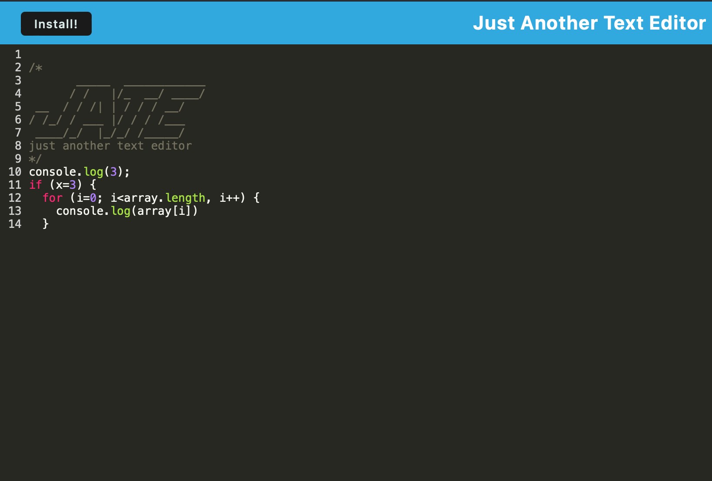

# js-text-editor

[Repo Link](https://github.com/crissyg923/installable-text-editor)

[Deployed Link](https://powerful-island-25507-2fbe7a244936.herokuapp.com/)

## Description
Text editor application that includes JS syntax highlighting to help guide the user while writing code.  In addition, this application utilizes the functionality of service workers to  cache previously written code and a manifest.json file to make the app installable.

## Table of Contents

1. [Installation](#installation)
2. [Usage](#usage)
3. [Credits](#credits)
4. [How to Contribute](#how-to-contribute)
5. [Tests](#tests)
6. [Questions](#questions)

## Installation
Clone the [repo](https://github.com/crissyg923/installable-text-editor).  Run 'npm i' and **npm run start:dev** to run the application on a local host.  Alternatively, to install this  as a user, head to the [deployed site](https://powerful-island-25507-2fbe7a244936.herokuapp.com/) and use the application as you would any other text ediotr.

## Usage
As a developer, you can use this code as a base to building your own text editor or study the files to understand the process of creating an installable app.

## Credits
This code was developed using starter code from Rutgers.

## How to Contribute
This application can be further developed by adding additional features, such as functionality to allow for downloading of created text files or an option to import files for editing.

## Tests
N/A

## License
MIT License
        Copyright (C) 2023 Crystal Green
        Permission is hereby granted, free of charge, to any person obtaining a copy
of this software and associated documentation files (the "Software"), to deal
in the Software without restriction, including without limitation the rights
to use, copy, modify, merge, publish, distribute, sublicense, and/or sell
copies of the Software, and to permit persons to whom the Software is
furnished to do so, subject to the following conditions:

The above copyright notice and this permission notice shall be included in all
copies or substantial portions of the Software.

THE SOFTWARE IS PROVIDED "AS IS", WITHOUT WARRANTY OF ANY KIND, EXPRESS OR
IMPLIED, INCLUDING BUT NOT LIMITED TO THE WARRANTIES OF MERCHANTABILITY,
FITNESS FOR A PARTICULAR PURPOSE AND NONINFRINGEMENT. IN NO EVENT SHALL THE
AUTHORS OR COPYRIGHT HOLDERS BE LIABLE FOR ANY CLAIM, DAMAGES OR OTHER
LIABILITY, WHETHER IN AN ACTION OF CONTRACT, TORT OR OTHERWISE, ARISING FROM,
OUT OF OR IN CONNECTION WITH THE SOFTWARE OR THE USE OR OTHER DEALINGS IN THE
SOFTWARE. 

## Questions
Crystal Green

(862) 205-9019

crissybrown1992@icloud.com

[Github](https://github.com/crissyg923)